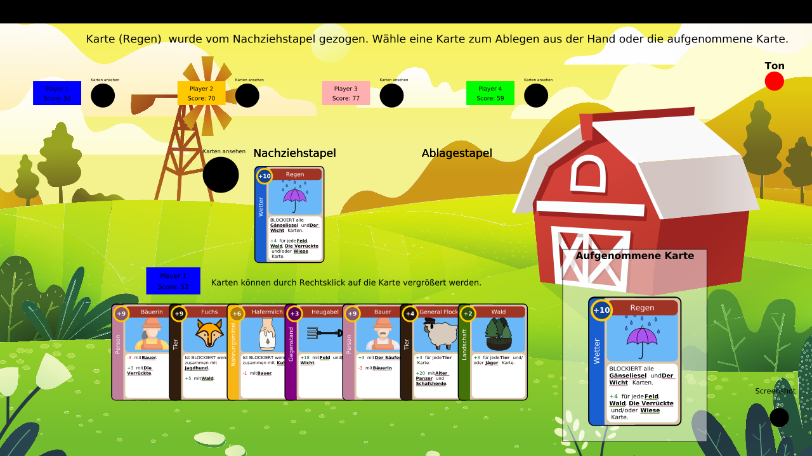
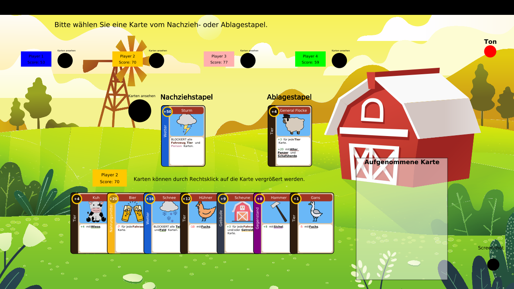

# Grow Man's Sky

## Description
This is a card game similar to the card game [fantasy realms](https://wizkids.com/fantasy-realms/), but farm-themed.
The game takes seconds to learn: draw a card, discard a card. Though in this case you can draw from the deck or the discard area!
Make the best hand you can by making the best combos. Aim for the highest score. 

## Dependencies
Make sure that you have at least
- [Apache Ant version 1.10.12](https://ant.apache.org/manual/index.html)
- [Java OpenJDK version 11.0.19](https://www.oracle.com/java/technologies/javase/jdk11-archive-downloads.html)
- [JavaDoc 11.0.19](https://docs.oracle.com/en/java/javase/11/javadoc/index.html#Java-Platform%2C-Standard-Edition)
 
installed on your system.

## Installation
1. Download the project files or clone the Git repository onto your system by using ```git clone https://github.com/nwuestefeld/Grow_mans_sky.git```
2. Run ```ant build``` in the root directory of the project to generate the executable JAR (running ```ant``` by itself will additionally generate JavaDoc files and run Junit tests). For just JavaDoc documentation on all the various classes, execute ```ant doc``` in the root directory. 

## Usage
Having successfully built the JAR file, you can run ```java -jar out/jar/GrowMansSky.jar -h``` or ```java -jar out/jar/Grow_mans_sky.jar --help``` to receive the following help page:
```
usage: java -jar out/jar/Grow_mans_sky.jar [-c <FILE>] [-con <HOST>] [-d
       <DELAY>] [-g] [-h] [-ll <LEVEL>] [-p <PORT>] [-pc <COLOR ...>] [-pn
       <NAME ...>] [-pt <TYPE ...>] [-v <VOLUME>]

=========================================================================
                       Grow Man's Sky <Version 1>
  Authors: Nils Wüstefeld, Jonas Härtner, Maxim Strzebkowski, Corinna
Liley
=========================================================================

Options:
 -c,--config <FILE>               The file from which the game
                                  configuration should be read.
 -con,--connect <HOST>            Connect as a client to the host.
 -d,--delay <DELAY>               Delay in milliseconds after a
                                  computerplayer has made his move.
 -g,--gui                         Show the GUI, even if no HUMAN player
                                  exists.
 -h,--help                        Print this help message and some extra
                                  information about this program.
 -ll,--loglevel <LEVEL>           The maximum log level. [ERRORS,
                                  WARNINGS, INFO, DEBUG]
 -p,--port <PORT>                 The port to be used when either hosting
                                  the game as a server or conntecting to a
                                  server as a client.
 -pc,--playerColors <COLOR ...>   The color(s) of the player(s). [RED,
                                  BLUE, ...]
 -pn,--playerNames <NAME ...>     The name(s) of the player(s).
 -pt,--playerTypes <TYPE ...>     The type(s) of the player(s). [HUMAN,
                                  RANDOM_AI, REMOTE]
 -v,--volume <VOLUME>             Volume of the soundeffects. (0-100)
                                  (SOUNDEFFECTS)

Preset: v1.2.1 (Thu Jul 06 03:48:56 CEST 2023)
SAG: v2.1.0 (Mon Jul 03 07:30:41 CEST 2023)
Implemented optional features:
  - SOUNDEFFECTS
  - SCREENSHOTS
```
Just running ```java -jar out/jar/GrowMansSky.jar``` without any options will start the default game consisting of:

- 4 Human players,
- names Player 1, Player 2, Player 3, Player 4
- colors blue, orange, pink, green
- the default game configuration.

It should look something like the following:


As you can see (provided you understand German), the game is prompting you to draw a card from either the draw pile (Nachziehstapel) or the discard pile (Ablagestapel).
Since there are no cards currently in the discard pile, you can click on the draw pile to draw the first card in the pile. Which would result in
the following scenario:



From there you can either choose to click on one of the cards in your hard to discard that one or on the card in the box to the right, which would
be the card you just drew. If you click on any of the cards, your turn is over and the next player picks a card to draw.



That's all there is to the game. You also have the option of right-clicking on any of the cards in your hand to magnify them or looking at any of the other players'
hands by clicking on the black circle next to their names (the exit button for the ensuing dialog window is on the top right). If you wish to pick a card from the discard
pile, you simply click on the discard pile and once it opens another window, you can click on whichever card you wish to draw from it.

Should you wish to take a screenshot of the current game status (as has been done for this README), you can simply click on the black circle in the bottom right-hand corner labeled "Screenshot".

If you have sound effects enable by calling the ```-v``` flag with a specified volume between 0 and 100, you can choose to mute the sound by clicking the circle labeled "Ton".
The button will appear read if the sound is muted and green if sound effects are enabled.

For a different configuration file, you can use the ```-c``` flag. We have provided the alternative configurations ```bauernhof.xml``` and ```fr.xml``` in this repository, for example ```java -jar out/jar/GrowMansSky.jar -c bauernhof.xml``` will
make it a very short game with only two cards on your hand and a maximum of three in the discard pile.

For network gaming, player on the server side has to start the game first by specifying a list of player types for the round, one of which has to be REMOTE, for example

```java -jar out/jar/GrowMansSky.jar -pt HUMAN HUMAN HUMAN REMOTE -pc BLUE RED GREEN YELLOW -pn Cora Jonas Maxim Nils```

will enable a server to play on with the remote client being played by Nils who, on his machine, executes the following command

```java -jar out/jar/GrowMansSky.jar -pt HUMAN -pn Nils -con <hostname>```

The default port for the connection is 6600, you can specify a different one with the ```-p``` flag. The flags ```-d``` and ```-g``` are only relevant for
games against a RANDOM_AI player. The former will make the AI wait for a specified amount of time after its move and the latter will show a GUI even when there are no HUMAN players in the game (highly recommended to
include a substantial delay in that situation or the GUI will not be able to update fast enough for the AI moves).

## Authors
Thanks to:

- **Corinna Margarete Liley**
- **Jonas Härtner**
- **Maxim Strzebkowski** 
- **Nils Wüstfeld**

for working on this project!

_README written by Maxim Strzebkowski, usage guide written by Jonas Härtner_
